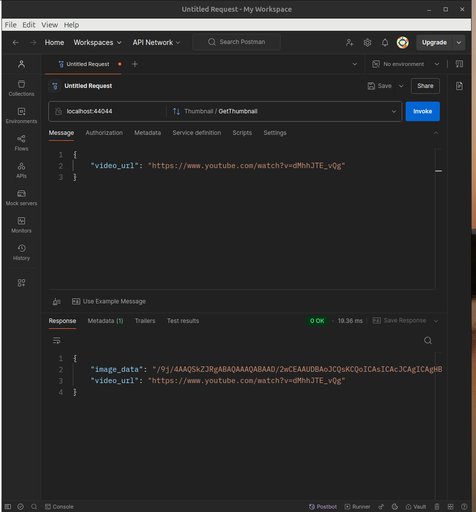
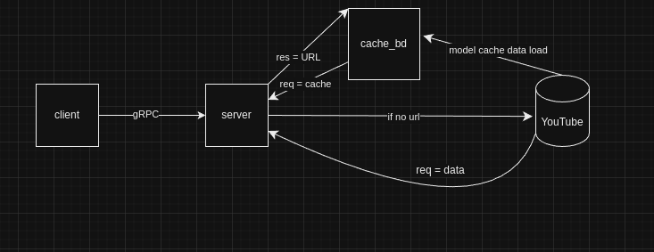

***
### Описание сервиса

Сервис **Thumbnail** предоставляет возможность получения превью (thumbnail) для указанного видео.

- **Метод:** `GetThumbnail`
- **Функция:** Возвращает изображение (в виде байтов) для превью видео и URL обработанного видео.
***
### Требования к окружению

Перед запуском сервиса необходимо убедиться, что окружение удовлетворяет следующим требованиям:
###### 1. **В проекте использованна последняя версия** [GO-1.23.3:](https://go.dev/)


###### 2. **Последняя версия** [Taskfile:](https://taskfile.dev/)

>[!info]
>Для облегечения ввода команд в консоль


###### 3. **GRPC и Protocol Buffers**:

- Пакет `protoc` версии 3.21 или выше.
- Установленные Go-модули:
```bash
go install google.golang.org/grpc/cmd/protoc-gen-go-grpc@latest
go install google.golang.org/protobuf/cmd/protoc-gen-go@latest
```

#### Сборка и запуск

>[!ERROR]
>Есть возможность, что при включенном VPN сервер не загрузит превью.
###### 1. Клонирование репозитория

Склонируйте проект:
```bash
git clone <URL_РЕПОЗИТОРИЯ>
cd <ИМЯ_ПАПКИ>
```
###### 2. Установка зависимостей

Установите необходимые зависимости `Go`:
```bash
go mod tidy
```

###### 3. Запуск сервиса

Запустите сервис локально (при помощи *Taskfile*):
```bash
cd proxy_server
task migration
task start
```

Или
```bash
cd proxy_server
go run ./cmd/migrator --storage-path=./storage/cache.db --migrations-path=./migrations # прокидование миграций
go run cmd/server/main.go # запуск сервиса
```

###### 4.1. Запуск клиента

Запустим клиент
```bash
cd proxy_client
task run
```

Или
```bash
cd proxy_client
go run cmd/client/main.go -urls="https://www.youtube.com/watch?v=RlGaKh-L5PM,https://www.youtube.com/watch?v=ziotOZhwz9Y" -async
```

###### 4.2 Запуск клиента через Postman




***
### Методы сервиса

###### `GetThumbnail`

- **Описание**: Метод для получения превью (thumbnail) видео.
- **Параметры**:
    - `ThumbnailRequest`:
        - `video_url` (string): URL видео.
- **Возвращаемое значение**:
    - `ThumbnailResponse`:
        - `image_data` (bytes): Данные превью в виде массива байтов.
        - `video_url` (string): URL обработанного видео.

Схематичное представление:



***
### Запуск тестов

- Выполните запуск сервера
```bash
cd proxy_server
task migration
task start
```

Или
```bash
cd proxy_server
go run ./cmd/migrator --storage-path=./storage/cache.db --migrations-path=./migrations
go run cmd/server/main.go # запуск сервиса

```

- Запуск тестов
```bash
cd proxy_server
task test
```

